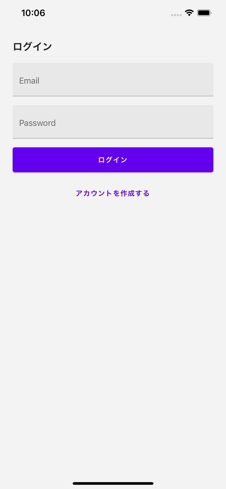
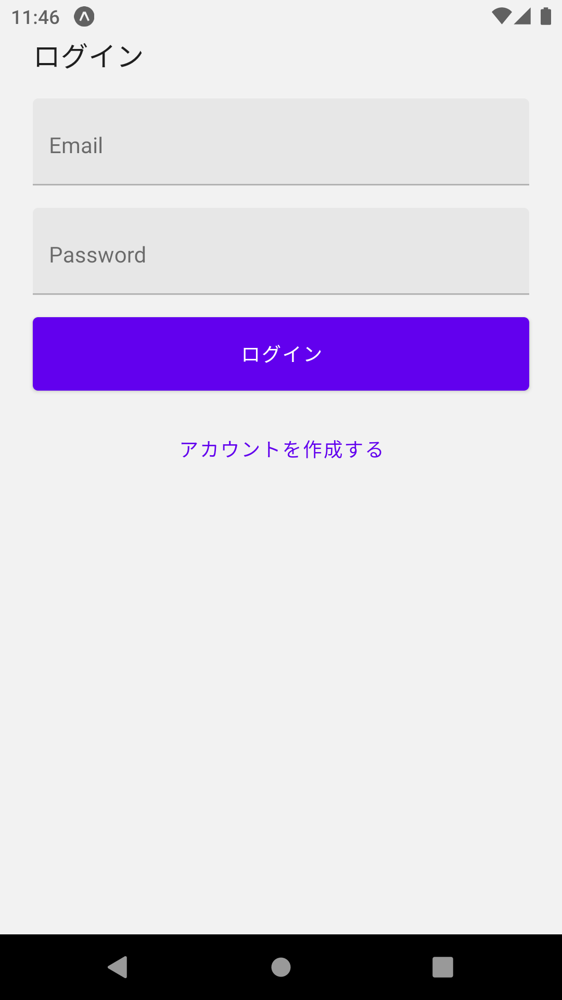

# expo-firebase-chat-example

このリポジトリは、[新生活応援！React Native ハンズオン 入門編 #3](https://react-native-meetup.connpass.com/event/213379/) のハンズオンでできる最終成果物です。

今回のハンズオンでは以下の目次の沿ってチャットアプリを作成していきます。

今までのハンズオンに参加してなくても最初から最後まで進められるようになっております。

## 目次

- [1. プロジェクトのセットアップ](#1.%20プロジェクトのセットアップ)
- [2. チャット画面の作成](#2.%20チャット画面の作成)
- [3. react-navigation のセットアップ](#3.%20react-navigation%20のセットアップ)
- [4. 登録・ログイン画面の作成](#4.%20ログイン画面の作成)
- [5. firebase との連携:アカウント登録](#5.%20firebase%20との連携:アカウント登録)
- [6. firebase との連携:db 接続](#6.%20firebase%20との連携:db%20接続)

## 前提条件

このハンズオンでは、以下の環境が必要となります。

- node.js v12+
- yarn
- firebase を使用するための Google アカウント

## 1. プロジェクトのセットアップ

この章では、react-native のアプリを作成するために必要なセットアップを行います。

react-native のアプリを作成するには主に以下の 2 つの方法があります。

- `@react-native-community/cli` を使ったプロジェクトの作成
- `expo-cli` を使ったプロジェクトの作成

`@react-native-community/cli` は react-native のコミュニティが提供している公式の cli パッケージであり、react-native をそのまま使ってアプリを作成する方法です。
こちらの方法は、サードパーティが作った機能などを全て使うことができて、自由度が高いです。
その代わり、アプリのビルドを行うのに多少のネイティブ開発の知識が必要となります。

`expo-cli` は `expo` という react-native の上に立っているフレームワークを使ってアプリを作成する方法です。
こちらは、ネイティブのビルド処理などを expo が賄ってくれるため、 javascript の知識だけでアプリが開発できるようになっています。
その代わり、expo では使用できるサードパーティ機能の数が限られており、react-native をそのまま書くよりは柔軟性が低いです。とはいえ、基本的なアプリを作成するのには十分な機能が備わっています。

今回のハンズオンでは、`expo-cli` を使ったプロジェクトを作成していきます。

### i. expo-cli のインストール

まずは、`expo-cli` をインストールします。

これをインストールすることによって、ターミナル上で `expo` コマンドが使えるようになります。

```
yarn global add expo-cli
```

### ii. 新しい expo project の作成

インストールした expo-cli を使って今回のハンズオン用のプロジェクトを作成してみましょう。

下記コマンドで新しく expo のプロジェクトを作成します。

```
expo init expo-firebase-chat
```

`expo init` の後の名前は好きな名前でかまいません。
このハンズオンでは、`expo-firebase-chat` というプロジェクト名で進めていきます。

コマンドを叩いたら、以下のような選択肢が出てきます。
このハンズオンでは、`blank` を選択します。
普段から TypeScript を使っているかたは、`blank(TypeScript)` でも問題ありません。


作成したプロジェクトのディレクトリに移動します

```
cd expo-firebase-chat
```

### iii. シミュレーターの立ち上げ

ここで、試しに initialize したアプリを立ち上げてみましょう。
以下のコマンドでアプリを立ち上げることができます。

```
expo start
```

コマンドを叩くと以下の様な画面が出てきます。


`a` を入力すると Android、`i` を入力すると iOS のシミュレータが立ち上がります。
お好みの方を立ち上げてみましょう。

このハンズオンでは iOS simulator を使って進めていきますが、Android でも基本的には同じです。

初回起動時は Expo GO というアプリがインストールされて、その中で今回のプロジェクトが立ち上がります。

以下のような画面が表示されるでしょう。

| iOS                                                                                     |
| --------------------------------------------------------------------------------------- |
|  |

試しに、`App.js` を開き、`<Text>` の中身を編集してみましょう。
編集して保存したら、変更がシミュレータにも反映されます。

これで、アプリを作成していく準備は完了です。

次の章から、チャットアプリに必要な画面を作っていきます。

## 2. チャット画面の作成

この章では、簡易的なチャット画面を作成します。

チャット画面の見た目は、 `react-native-gifted-chat` というライブラリを使って作成します。

### i. react-native-gifted-chat のインストール

まずは必要なライブラリをインストールします。

```
yarn add react-native-gifted-chat
```

これで、プロジェクト内で `GiftedChat` のコンポーネントを作成できるようになります。

### ii. チャット画面の作成

`App.js` の中身を消して、以下のように変更しましょう。

```jsx
// App.js
import * as React from "react";
import { View, StyleSheet, KeyboardAvoidingView } from "react-native";
import { GiftedChat } from "react-native-gifted-chat";

const styles = StyleSheet.create({
  container: { flex: 1 },
});

export default App () {
  // 表示するチャットメッセージの配列
  const [messages, setMessages] = React.useState([]);

  React.useEffect(() => {
    setMessages([
      {
        _id: 1,
        text: "Hello developer",
        createdAt: new Date(),
        user: {
          _id: 2,
          name: "React Native",
          avatar: "https://placeimg.com/140/140/any",
        },
      },
    ]);
  }, []);

  const onSend = React.useCallback((messages = []) => {
    setMessages((previousMessages) =>
      GiftedChat.append(previousMessages, messages)
    );
  }, []);

  return (
    <View style={styles.container}>
      <GiftedChat
        messages={messages}
        placeholder="メッセージを入力してください..."
        onSend={onSend}
        user={{
          _id: 1,
          name: "Me",
          avatar: "https://placeimg.com/140/140/any",
        }}
      />
      {Platform.OS === "android" && <KeyboardAvoidingView behavior="padding" />}
    </View>
  );
};
```

これが GiftedChat のデフォルトの見た目となります。
試しに、適当に文字を入力してみましょう。
以下のような画面になります。

| iOS                                                                           |
| ----------------------------------------------------------------------------- |
|  |

チャット画面の見た目はこれだけで完了となります！

`react-native-gifted-chat` はチャット画面を作成するのに必要な機能がたくさん備わっており、吹き出しの見た目の変更や`入力中...`と表示させたり、柔軟な対応ができます。

今回のハンズオンでは、最低限の見た目しか作成しませんが、興味がある人はここから更に自分だけのチャットアプリの見た目を作っていくのも良いでしょう。

詳しくは [react-native-gifted-chat のリポジトリ](https://github.com/FaridSafi/react-native-gifted-chat)を参照してみてください。

チャットの見た目を Slack の用に変更するための設定も同作者が [example](https://github.com/FaridSafi/react-native-gifted-chat/tree/master/example-slack-message/src) を提供しています。

### iii. ファイルの分割

今回作成するアプリはチャット画面の他に、ログイン画面や新規登録画面など、複数の画面を作成することになります。

これらを全て `App.js` の中で書くことも可能ではありますが、コードの見通しがとても悪くなるので、画面ごとにファイルを分割します。

まずは、各画面を入れる、`src/screens` ディレクトリを新しく作成しましょう。

```
mkdir src/screens
```

そして、先程 `App.js` に書いた内容を、`src/screens/ChatScreen.js` にコピーします。

この際、export する関数の名前を `App` から `ChatScreen` に変更します。

```jsx
// src/screens/ChatScreen.js
import * as React from "react";
import {
  SafeAreaView,
  View,
  StyleSheet,
  KeyboardAvoidingView,
} from "react-native";
import { GiftedChat } from "react-native-gifted-chat";

const styles = StyleSheet.create({
  container: { flex: 1 },
});

export const ChatScreen = () => {
  // 表示するチャットメッセージの配列
  const [messages, setMessages] = React.useState([]);

  React.useEffect(() => {
    setMessages([
      {
        _id: 1,
        text: "Hello developer",
        createdAt: new Date(),
        user: {
          _id: 2,
          name: "React Native",
          avatar: "https://placeimg.com/140/140/any",
        },
      },
    ]);
  }, []);

  const onSend = React.useCallback((messages = []) => {
    setMessages((previousMessages) =>
      GiftedChat.append(previousMessages, messages)
    );
  }, []);

  return (
    <SafeAreaView style={styles.container}>
      <View style={styles.container}>
        <GiftedChat
          messages={messages}
          placeholder="メッセージを入力してください..."
          onSend={onSend}
          user={{
            _id: 1,
            name: "Me",
            avatar: "https://placeimg.com/140/140/any",
          }}
        />
        {Platform.OS === "android" && (
          <KeyboardAvoidingView behavior="padding" />
        )}
      </View>
    </SafeAreaView>
  );
};
```

`App.js` の中身を以下の用に変更しましょう。

```jsx
// App.js
import * as React from "react";
import { ChatScreen } from "./src/screens/ChatScreen";

export default function App() {
  return <ChatScreen />;
}
```

これで、先程作った画面と同じ画面がシミュレータ上に表示されます。

アプリの見た目上はなにも変わっていませんが、これでアプリに更に画面を追加する準備ができました。

## 2. react-navigation のセットアップ

このステップでは、アプリに画面を追加するために、`react-navigation` というライブラリのセットアップをします。

### i. 必要ライブラリのインストール

react-navigation の使用には、必要になるライブラリの数が少し多いので、コマンドをコピペして進めていきましょう。

以下のコマンドを入力してください。

```
expo install react-native-gesture-handler react-native-reanimated react-native-screens react-native-safe-area-context @react-native-community/masked-view
```

これらのパッケージは react-native の画面遷移に使うライブラリである react-navigation に必要になるパッケージ郡となります。
次に、画面遷移用のライブラリである `react-navigation` 類をインストールします。

```
expo install @react-navigation/native @react-navigation/stack
```

これで、react-navigation を使う準備はできました。

### ii. NavigationContainer の設定

`App.js` の中身を以下の用に変更しましょう。

```jsx
// App.js
import "react-native-gesture-handler";
import * as React from "react";
import { NavigationContainer } from "@react-navigation/native";

export default function App() {
  return <NavigationContainer></NavigationContainer>;
}
```

最初に `react-native-gesture-handler` を import しているのは、プロジェクト全体で画面遷移のためのスワイプ等のジェスチャーを有効にするために必要な設定です。

```jsx
import "react-native-gesture-handler";
```

`NavigationContainer` 自体はなにも見た目を持ちませんが、現在表示している画面や、画面遷移のために必要な Context が含まれています。基本的に react-navigation を使用するアプリは全てこの `NavigationContainer` の中で行われます。

```jsx
<NavigationContainer></NavigationContainer>
```

この段階ではアプリ上にはなにも表示されません。

次に、NavigationContainer の中に追加する `Stack` というものを作成していきます。

### iii. MainStack の作成

`Stack` は react-navigation の基本的な画面郡のことを指します。

Stack の中には複数の画面を設けることができ、react-navigation の機能を使って、その画面を行き来することになります。

Stack 自体を複数作成することもでき、用途によって、Stack を分けたりすることもできます。

このハンズオンでは、ログイン前の画面郡を管理する `AuthStack` 及び、ログイン後の画面郡を管理する `MainStack` の 2 つの Stack を作成します。

navigation 関連のファイルは自分の場合、`navigation` というディレクトリを作成して、そこにまとめる場合が多いです。

早速新しく `src/navigations` ディレクトリを作成しましょう。

```
mkdir src/navigations
```

そして、`src/navigations` に新しく `MainStack.js` を作成して、以下のように記入しましょう。

```jsx
// src/navigations/MainStack.js
import * as React from "react";
import { createStackNavigator } from "@react-navigation/stack";

import { ChatScreen } from "../screens/ChatScreen";

const Stack = createStackNavigator();

export const MainStack = () => {
  return (
    <Stack.Navigator initialRouteName="Chat">
      <Stack.Screen name="Chat" component={ChatScreen} />
    </Stack.Navigator>
  );
};
```

`createStackNavigator` は `Stack.Navigator` と `Stack.Screen` の 2 つのコンポーネントを作成する関数です。

`Stack.Navigator` は Stack の Context を保持するコンポーネントです。

`initialRouteName` はその Stack 内で最初に表示する Screen 名を設定します。

`Stack.Screen` は Stack の中で表示する画面を保持します。

今回作成した `MainStack` はチャット画面を表示する `ChatScreen` のみを入れています。

 次に、作成した `MainStack` を先程作成した `NavigationContainer` の中に入れましょう。

```jsx
// App.js
import "react-native-gesture-handler";
import * as React from "react";
import { NavigationContainer } from "@react-navigation/native";
import { MainStack } from "./src/navigations/MainStack";

export default function App() {
  return (
    <NavigationContainer>
      <MainStack />
    </NavigationContainer>
  );
}
```

これで、先程作ったチャット画面がまた表示されるようになったはずです。

次はアカウント新規登録用の画面やログイン用の画面を作成していきます。

## 4. ログイン画面の作成

この章では、アカウントの新規登録、及びログインのための画面を作成します

### i. AuthStack の作成

まずは
`src/navigations` に新しく `AuthStack.js` を作成しましょう。

```jsx
// src/navigations/AuthStack.js
import * as React from "react";
import { createStackNavigator } from "@react-navigation/stack";

const Stack = createStackNavigator();

export const AuthStack = () => {
  return <Stack.Navigator headerMode="none"></Stack.Navigator>;
};
```

これは、ログインする前にユーザーが見れる画面郡を定義するファイルとなります。

この時点では、AuthStack の中になんの画面も定義されていない状態です。

ひとまず、この AuthStack も NavigationContainer の中に含めましょう

`App.js` を以下のように変更します。

```jsx
// App.js
import "react-native-gesture-handler";
import * as React from "react";
import { NavigationContainer } from "@react-navigation/native";
import { AuthStack } from "./src/navigations/AuthStack";
import { MainStack } from "./src/navigations/MainStack";
export default function App() {
  const loggedIn = false;
  return (
    <NavigationContainer>
      {loggedIn ? <MainStack /> : <AuthStack />}
    </NavigationContainer>
  );
}
```

このように、ユーザーがログインしているかどうかを判断して、表示する画面を分けることができます。
今はまだ、ログイン処理を書いていないため、非ログイン状態であることをハードコードしています。

### ii. 必要なパッケージのインストール

ログイン画面、新規登録画面の見た目は `react-native-paper` という UI ライブラリを使って作成します。

```
yarn add react-native-paper
```

### iii. ログイン画面の見た目の作成

次に、簡易的なログイン用の画面を作成しましょう。

`src/screens` に新しく、`LoginScreen.js` を作成しましょう。

```jsx
// src/screens/LoginScreen.js
import * as React from "react";
import { View, StyleSheet, SafeAreaView } from "react-native";
import { Title, TextInput, Button } from "react-native-paper";

const styles = StyleSheet.create({
  flex: {
    flex: 1,
  },
  paddingLarge: {
    padding: 24,
  },
  marginBottom: {
    marginBottom: 16,
  },
  paddingSm: {
    padding: 8,
  },
});

export const LoginScreen = () => {
  const [email, setEmail] = React.useState("");
  const [password, setPassword] = React.useState("");

  return (
    <SafeAreaView style={styles.flex}>
      <View style={[styles.flex, styles.paddingLarge]}>
        <Title style={styles.marginBottom}>ログイン</Title>
        <TextInput
          label="Email"
          value={email}
          onChangeText={setEmail}
          autoCapitalize="none"
          keyboardType="email-address"
          style={styles.marginBottom}
        />
        <TextInput
          label="Password"
          value={password}
          onChangeText={setPassword}
          secureTextEntry
          style={styles.marginBottom}
        />
        <Button
          mode="contained"
          style={[styles.paddingSm, styles.marginBottom]}
          onPress={() => {}} // TODO: 仮の値を入れている
        >
          ログイン
        </Button>
        <Button
          style={[styles.paddingSm, styles.marginBottom]}
          onPress={() => {}} // TODO: 仮の値を入れている
        >
          アカウントを作成する
        </Button>
      </View>
    </SafeAreaView>
  );
};
```

以下のような見た目になります。

| iOS                                                                    | Android                                                                            |
| ---------------------------------------------------------------------- | ---------------------------------------------------------------------------------- |
|  |  |

この画面を `AuthStack.js` 上で表示する用にします。

先程作成した `AuthStack.js` を以下のように変更しましょう。

```jsx
// src/navigations/AuthStack.js
import * as React from "react";
import { createStackNavigator } from "@react-navigation/stack";
import { LoginScreen } from "../screens/LoginScreen"; // この部分を追加

const Stack = createStackNavigator();

export const AuthStack = () => {
  return (
    <Stack.Navigator initialRouteName="Login" headerMode="none">
      <Stack.Screen name="Login" component={LoginScreen} /** この部分を追加 */>
    </Stack.Navigator>
  );
};
```

これで、エミュレータ上で、先程作成したログイン画面が表示されるようになります。

### iv. 新規登録画面の見た目の作成

続いて、アカウント新規登録用の画面を作成しましょう。

`src/screens` に新しく、`SignUpScreen.js` を作成しましょう。

中身はほとんど、`LoginScreen.js`と同じです。

```jsx
// src/screens/SignUpScreen.js
import * as React from "react";
import { View, StyleSheet, SafeAreaView } from "react-native";
import { Title, TextInput, Button } from "react-native-paper";

const styles = StyleSheet.create({
  flex: {
    flex: 1,
  },
  paddingLarge: {
    padding: 24,
  },
  marginBottom: {
    marginBottom: 16,
  },
  paddingSm: {
    padding: 8,
  },
});

export const SignUpScreen = () => {
  const [email, setEmail] = React.useState("");
  const [password, setPassword] = React.useState("");

  return (
    <SafeAreaView style={styles.flex}>
      <View style={[styles.flex, styles.paddingLarge]}>
        <Title style={styles.marginBottom}>新規登録</Title>
        <TextInput
          label="Email"
          value={email}
          onChangeText={setEmail}
          autoCapitalize="none"
          keyboardType="email-address"
          style={styles.marginBottom}
        />
        <TextInput
          label="Password"
          value={password}
          onChangeText={setPassword}
          secureTextEntry
          style={styles.marginBottom}
        />
        <Button
          mode="contained"
          style={[styles.paddingSm, styles.marginBottom]}
          onPress={() => {}} // TODO: 仮の値を入れている
        >
          新規登録
        </Button>
        <Button
          style={[styles.paddingSm, styles.marginBottom]}
          onPress={() => {}} // TODO: 仮の値を入れている
        >
          既存アカウントでログインする
        </Button>
      </View>
    </SafeAreaView>
  );
};
```

この画面も `LoginScreen` と同じく、 `AuthStack.js` 上で表示する用にします。

`AuthStack.js` を以下のように変更しましょう。

```jsx
// src/navigations/AuthStack.js
import * as React from "react";
import { createStackNavigator } from "@react-navigation/stack";
import { LoginScreen } from "../screens/LoginScreen";
import { SignUpScreen } from "../screens/SignUpScreen"; // この部分を追加

const Stack = createStackNavigator();

export const AuthStack = () => {
  return (
    <Stack.Navigator initialRouteName="Login" headerMode="none">
      <Stack.Screen name="Login" component={LoginScreen} />
      <Stack.Screen name="SignUp" component={SignUpScreen} /** この部分を追加　*/>
    </Stack.Navigator>
  );
};
```

これで、ログイン画面と新規登録画面が AuthStack の中に含まれました。

しかし、どうやってこれらの画面を行き来すればいいのでしょう？

### v. 画面遷移を実装する

ここでは、ログイン画面と新規登録画面を行き来するためのロジックを実装します。

画面の遷移には、`@react-navigation/native` が提供している `useNavigation` という関数を使用します。

まずは、先程作成したログイン画面、`LoginScreen.js` に以下の内容を追記します。

````jsx
// src/screens/LoginScreen.js
import { useNavigation } from '@react-navigation/native'

...

export const LoginScreen = () => {
    const navigation = useNavigation()
    ...

    return (
      ...
      <Button
        style={[styles.paddingSm, styles.marginBottom]}
        onPress={() => {
          navigation.navigate("SignUp");
        }}
      >
        アカウントを作成する
      </Button>
      ...
    );
}
```

`useNavigation` は呼び出すと、その Context 内の情報を持つ `navigation` インスタンスを作成します。

```js
const navigation = useNavigation();
````

`navigation` は画面を行き来するための`navigate`等のメソッドを持っています。

```js
navigation.navigate("SignUp");
```

`navigate` の引数に入れる文字列は、`Stack.Screen` に定義した `name` の値を入れます。

これで、ログイン画面の`アカウントを作成する`をタップしたら、新規登録画面に行けるようになりました。

このままでは、ログイン画面に戻れないので、新規登録画面にも同じ用に以下の内容を追記します。

```jsx
// src/screens/SignUpScreen.js
import { useNavigation } from '@react-navigation/native'

...

export const SignUpScreen = () => {
    const navigation = useNavigation()
    ...

    return (
      ...
      <Button
        style={[styles.paddingSm, styles.marginBottom]}
        onPress={() => {
          navigation.navigate("Login");
        }}
      >
        既存アカウントにログインする
      </Button>
      ...
    );
}
```

これでログイン画面の新規登録画面を行き来できる用になりました。

今回のハンズオンで作成する見た目は以上となります。

次の章から、firebase を使って実際のアカウントの作成や、チャットのログを db に保管する用に変更していきます。

## 5. firebase との連携:アカウント登録

この章では、firebase を使ったアカウントの作成や、db との接続を行います。

### i. firebase プロジェクトの作成。

まずは、新しく firebase のプロジェクトをこのハンズオン用に作成します。

[Firebase のコンソール](https://console.firebase.google.com/)にアクセスして、お使いの Google アカウントでログインしてください。

Firebase のプロジェクトを作るのが初めての場合、以下の様な画面が表示されます。

`Create a Project` をクリックしてください。


好きなプロジェクト名を入力して、プロジェクトを作成します。

作成した後の画面にて、プラットフォームを選択する画面があるので、`Web` を選びましょう。


好きなアプリ名を入力して、アプリの設定を作成します。

`firebaseConfig` に firebase に必要な設定値が表示されているので、それをコピーしましょう。この値は `iii` で使います。


### ii. authentication の設定

このハンズオンでは、email と password を使ってアカウントの新規登録やログイン処理を行います。

firebase console の画面左に表示されるメニューから Authentication を選択し、email/password でのログインができるように設定しましょう。

### iii. firebase sdk のインストール

今回のハンズオンのプロジェクト内でも firebase を呼び出せるようにするために、firebase をインストールしましょう

```
yarn add firebase
```

### iv. firebase の設定

アプリのルートに　 `firebase.js` を作成して、以下のように記載しましょう。

`firebaseConfig` には、先程コピーした firebase の設定値を入れましょう。

```js
// firebase.js

import * as firebase from "firebase";
import "firebase/auth";
import "firebase/firestore";

/**
 * コピーしたFirebase の Config を入れる
 */
const firebaseConfig = {
  apiKey: "",
  authDomain: "",
  projectId: "",
  storageBucket: "",
  messagingSenderId: "",
  appId: "",
  measurementId: "",
};

let app;
if (firebase.apps.length === 0) {
  app = firebase.initializeApp(firebaseConfig);
} else {
  app = firebase.app();
}

const db = app.firestore();
const auth = firebase.auth();

export { db, auth };
```

これで、認証情報を扱う `auth` と DB にアクセスする `db` が使えるようになります。

### v. 新規登録処理の実装

早速、`SignUpScreen.js` に新規登録のロジックを追加しましょう。

```jsx
// src/screens/SignUpScreen.js
...
import { auth } from "../../firebase";

...

export const SignUpScreen = () => {

    ...

  /**
   * アカウントを登録する
   */
  const signup = () => {
    auth
      .createUserWithEmailAndPassword(email, password)
      .then(() => {
        console.log("Register Success!");
      })
      .catch((error) => {
        console.error(error.message);
      });
  };

    return (
      ...
        <Button
          mode="contained"
          style={[styles.paddingSm, styles.marginBottom]}
          onPress={signup}
        >
          新規登録
        </Button>
      ...
    );
}
```

`createUserWithEmailAndPassword` は、引数に渡した email と password でアカウントを作成するためのメソッドです。

> 参考：[firebase のドキュメント: createUserWithEmailAndPassword](https://firebase.google.com/docs/auth/web/start)

これで入力した email とパスワードによってアカウントの新規登録が可能となります。

試しに、シミュレータで新規登録画面を開き、ご自身の email を入力して、パスワードは適当に 5 文字以下の文字列を入力して「新規登録」ボタンを押してみましょう。

firebase のアカウントはデフォルトで 5 文字以下のパスワードは使えないようになっているので、エラーが表示されます。

あたらめて、6 文字以上のパスワードでアカウントを新規登録してみましょう。

console の方を見ると、`Register Success!` というログが表示されるでしょう。

しかし、画面の方はなにも変化がありません。

これは、ログインしたときに、自分がログイン状態であるかどうかを識別していないからとなります。

### vi. AuthState に subscribe する

自分がログイン状態であるかを判別するのは、`MainStack` と `AuthStack` を切り替える `App.js` の中で行います。

`App.js` の中身を以下のように変更してみましょう。

```jsx
// App.js
import "react-native-gesture-handler";
import * as React from "react";
import { NavigationContainer } from "@react-navigation/native";
import { AuthStack } from "./src/navigations/AuthStack";
import { MainStack } from "./src/navigations/MainStack";
import { auth } from "./firebase";

export default function App() {
  const [loggedIn, setLoggedIn] = React.useState(false);

  React.useEffect(() => {
    const unsubscribe = auth.onAuthStateChanged((user) => {
      if (user) {
        // ログイン中
        setLoggedIn(true);
      } else {
        // ログアウト中
        setLoggedIn(false);
      }
    });
    return unsubscribe;
  });

  return (
    <NavigationContainer>
      {loggedIn ? <MainStack /> : <AuthStack />}
    </NavigationContainer>
  );
}
```

`auth.onAuthStateChanged` はログイン状態が変更されたかどうかのイベントを待つ Listener となります。
ログイン状態が変更された時に、ここに入れた callback が発火されます。

> 参考：[firebase のドキュメント: onAuthStateChanged](https://firebase.google.com/docs/auth/web/manage-users)

これで、user 情報がある際は `loggedIn` 状態を true にすることで、チャット画面を持つ `MainStack` に画面が切り替わる用になります。

再び、新規登録画面にてアカウントを登録してみましょう。

先程作成したアカウントはすでに登録済みのアカウントのため、エラーが出てしまいます。

なので、メールアドレスに `+1` をつける等で別の email 扱いにしてアカウントを作成すると、今度はチャット画面に以降できる用になります。

### vii. ログアウト処理の実装

今度はログイン機能を試してみたいところですが、一度ログイン状態になったらセッションが切れるまでログイン状態になってしまいます。
なので、先にログアウトするための処理を実装します。

`ChatScreen.js` に以下のように追記しましょう。

```jsx
// src/screens/ChatScreen.js
...
import { useNavigation } from "@react-navigation/core";
import { Button } from "react-native-paper";
import { auth } from "../../firebase";

...

export const ChatScreen = () => {
  const navigation = useNavigation();
  const signOut = () => {
    auth
      .signOut()
      .then(() => {
        console.log("Sign out success!");
      })
      .catch((error) => {
        console.error(error.message);
      });
  };

  React.useLayoutEffect(() => {
    navigation.setOptions({
      headerRight: () => <Button onPress={signOut}>ログアウト</Button>,
    });
  }, []);
  ...
};

```

ここでも `useNavigation` を使っています。

今回は、画面上に表示されているヘッダーの右上に「ログアウト」ボタンを追加するために、`navigation.setOptions` を呼び出しています。
ヘッダーは `react-navigation` の管轄のため、この様な処理になっています。

> 参考: [react-navigation のドキュメント: Header interaction with its screen component](https://reactnavigation.org/docs/header-buttons/#header-interaction-with-its-screen-component)

> 参考: [firebase のドキュメント: signout](https://firebase.google.com/docs/reference/js/firebase.auth.Auth#signout)

これで、ログアウトボタンを押したら、ログイン画面に戻れるはずです。

### viii. ログイン処理の実装

新規登録と同じ用に、今度はログインの処理を実装してみましょう。

`LoginScreen.js` に以下のように追記しましょう。

```jsx
// src/screens/LoginScreen.js
...
import { auth } from "../../firebase";

...

export const LoginScreen = () => {

    ...

  /**
   * ログインする
   */
  const signin = () => {
    auth
      .signInWithEmailAndPassword(email, password)
      .then(() => {
        console.log("Signin Success!");
      })
      .catch((error) => {
        console.error(error.message);
      });
  };

    return (
      ...
        <Button
          mode="contained"
          style={[styles.paddingSm, styles.marginBottom]}
          onPress={signin}
        >
          ログイン
        </Button>
      ...
    );
}
```

`signInWithEmailAndPassword` は、引数に渡した email と password でアカウントを作成するためのメソッドです。

> 参考：[firebase のドキュメント: signinwithemailandpassword](https://firebase.google.com/docs/reference/js/firebase.auth.Auth#signinwithemailandpassword)

これでログイン処理も完了となります。

## 6. firebase との連携:db 接続

この章がこのハンズオンの最終章です。

この章では、firebase 上にチャットの履歴を保存して、それをアプリ上で表示するようにしていきます。

### i. fire store のセットアップ

まずはチャットの履歴を保存するための DB をセットアップします。

firebase のコンソールを開き、左のメニューから `Firestore Database` を選択して、`Create new database` を選択します。

`production` と `test` の選択肢がありますが、今回のハンズオンでは `test` を使います。

画面を進めていけば test 用の db が作成されます。

これで、チャットの履歴を保存する準備は完了です。

### ii. DB を使う用にチャット画面の実装を変更

`ChatScreen.js` を以下のように変更します。

```jsx
// src/screens/ChatScreen.js
import * as React from "react";
import {
  SafeAreaView,
  View,
  StyleSheet,
  KeyboardAvoidingView,
} from "react-native";
import { GiftedChat } from "react-native-gifted-chat";
import { useNavigation } from "@react-navigation/core";
import { Button } from "react-native-paper";
import { auth, db } from "../../firebase"; // この部分に db を追加
const styles = StyleSheet.create({
  container: { flex: 1 },
});

export const ChatScreen = () => {
  const navigation = useNavigation();
  const signOut = () => {
    auth
      .signOut()
      .then(() => {
        console.log("Sign out success!");
      })
      .catch((error) => {
        console.error(error.message);
      });
  };

  React.useLayoutEffect(() => {
    navigation.setOptions({
      headerRight: () => <Button onPress={signOut}>ログアウト</Button>,
    });
  }, []);

  // 表示するチャットメッセージの配列
  const [messages, setMessages] = React.useState([]);

  // 以前 useEffect だった部分を消し、以下のコードを追加
  React.useLayoutEffect(() => {
    const unsubscribe = db
      .collection("chats")
      .orderBy("createdAt", "desc")
      .onSnapshot((snapshot) =>
        setMessages(
          snapshot.docs.map((doc) => ({
            _id: doc.data()._id,
            createdAt: doc.data().createdAt.toDate(),
            text: doc.data().text,
            user: doc.data().user,
          }))
        )
      );
    return unsubscribe;
  }, []);

  const onSend = React.useCallback((messages = []) => {
    setMessages((previousMessages) =>
      GiftedChat.append(previousMessages, messages)
    );
    // 以下の部分を追加
    const { _id, createdAt, text, user } = messages[0];
    db.collection("chats").add({
      _id,
      createdAt,
      text,
      user,
    });
  }, []);

  return (
    <SafeAreaView style={styles.container}>
      <View style={styles.container}>
        <GiftedChat
          messages={messages}
          placeholder="メッセージを入力してください..."
          onSend={onSend}
          user={{
            _id: auth?.currentUser?.email, // ここを変更
          }}
        />
        {Platform.OS === "android" && (
          <KeyboardAvoidingView behavior="padding" />
        )}
      </View>
    </SafeAreaView>
  );
};
```

これにて、簡易チャットアプリの完成です！

可能であれば、2 つのシミュレータを立ち上げてみて、チャット機能が動くかどうかを試してみましょう！
